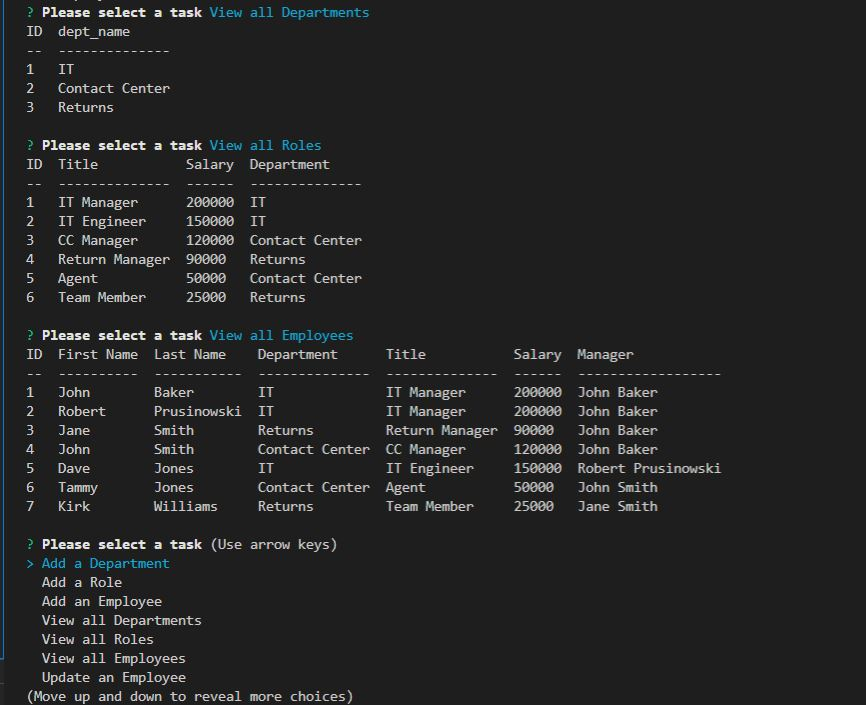

# Employee Trakker

<!-- TABLE OF CONTENTS -->

  
Table of Contents

  <ol>
    <li><a href="#description">Description</a></li>
    <li><a href="#user-story">User Story</a></li>
    <li><a href="#built-with">Built With</a></li>
    <li><a href="#maintainer">Contributing</a></li>
    <li><a href="#license">License</a></li>
    <li><a href="#screenshot">Screenshot</a></li>
  </ol>

## Description

This tool is a command-line application from scratch to manage a company's employee database.

## User Story

AS A business owner
I WANT to be able to view and manage the departments, roles, and employees in my company
SO THAT I can organize and plan my business

## Built-with

JavaScript, Node, NPM, express.js

## Maintainer

<a href="mailto:bobpruz@gmail.com">Email: Robert Prusinowski</a>

 ## License

  

## Screenshot

